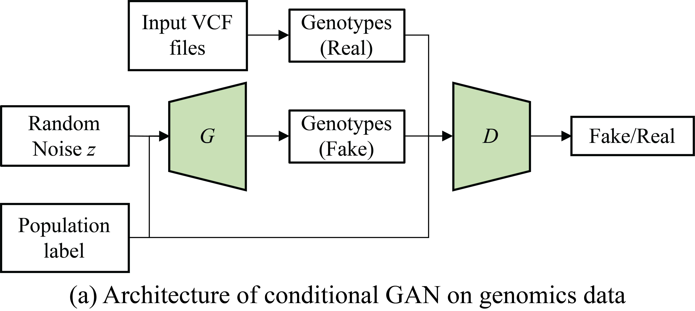
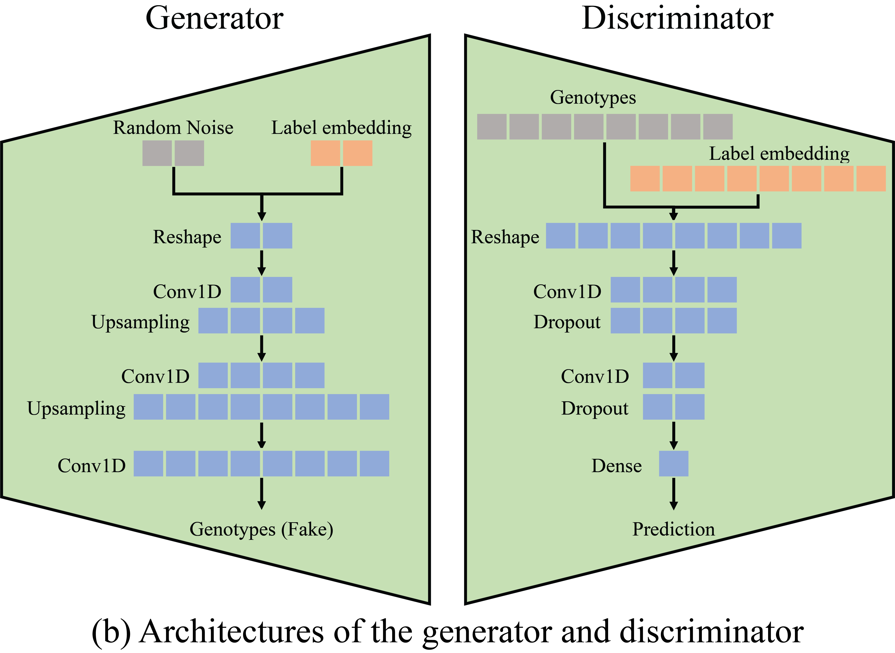

# Population-scale Genomics Data Augmentation Based on Conditional Generative Adversarial Networks  

## Introduction
Although next generation sequencing technologies have made it possible to quickly generate a large collection of genomes, it is sometimes infeasible (e.g. in rare disease studies where samples are limited) to quickly produce a large number of genomes. Additionally, due to privacy and security concerns, human genomics data are not readily or widely accessible. Models built on small and imbalanced datasets can thus be biased or inaccurate, as a result, conclusions can be error-prone or unfair. In order to address this problem, we develop a Population-scale Genomic Data Augmentation based on Conditional Generative Adversarial Networks (PG-cGAN) to enhance the amount and diversity of genomic data by transforming samples already in the data rather than collecting new samples. PG-cGAN is stacked with convolutional layers, aiming to capture underlying structures such as linkage disequilibrium (LD) patterns in genomic data. We demonstrated the application of the proposed PG-cGAN model to augment human genotypes data for human leukocyte antigen (HLA) regions, using genotypes from the 1000 Genomes project with 2,504 samples from five super-populations worldwide. Our results for augmenting genotypes in human leukocyte antigen (HLA) regions showed that PC-cGAN can generate new genotypes with similar population structure, variant frequency distributions and LD patterns. PG-cGAN can also generate and augment human genomic data for any specific population with corresponing population label as input condition information. This advantange of flexiable augmentation makes PG-cGAN great potential to improve reliability and fairness of downstream analysis. Since the only input for PC-cGAN is the original genomic data without assumptions about model parameters or data distributions, it can be extended to enrich many other types of biomedical data and beyond. 

(a) Architecture of conditional GAN on genomics data  |  (b) Architectures of the generator and discriminator
:-------------------------:|:-------------------------:  
         |    

<p align="justify"> <strong>Fig. 1.</strong> Architecture of the proposed PG-cGAN model for genomics data augmentation. 
The generator accepts a population label as a condition, and then embeds it to the same dimension with a noise vector, in order to join with the noise input by multiplication. The discriminator also accepts a population label as a condition, and then embeds it to the same dimension with the genotype vector, in order to join with the genotype input by multiplication. </p>

## Getting Started
These instructions will get you a copy of the project up and running on your local machine for development and testing purposes. The code is performed in a Jupyter Notebook, because Jupyter Notebook provides an interactivly develop and test manner, which is very convient for practical purpose. 

1. Prerequisites
```
Python >= 3.6 
virtualenv >= 16.4.3
```
2. Create virtual environment
```
git clone https://github.com/shilab/PG-cGAN.git
cd PG-cGAN
mkdir venv
python3 -m venv venv/
source venv/bin/activate
```
3. Install requirment dependents
```
pip install tensorflow sklearn pandas jupyter matplotlib seaborn
```

## Citation  
Junjie Chen, Mohammad Erfan Mowlaei, and Xinghua Shi*. 2020. Population-scale Genomics Data Augmentation Based on Conditional Generative Adversarial Networks. In Proceedings of the 11th ACM International Conference on Bioinformatics, Computational Biology and Health Informatics (BCB ’20), September 21–24, 2020, Virtual Event, USA. ACM, NewYork, NY, USA, 6 pages. https://doi.org/10.1145/3388440.3412475
